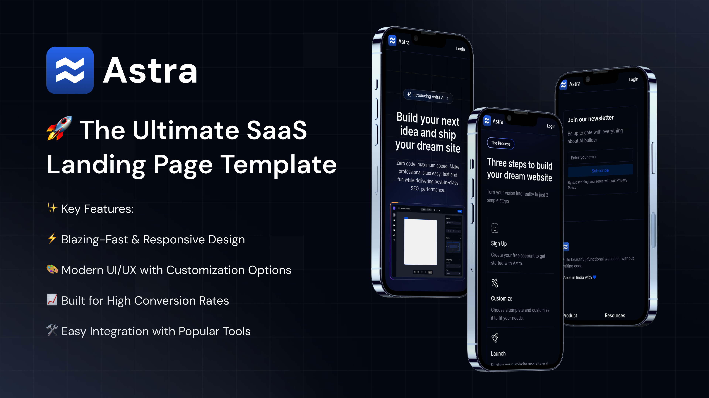

<h1 align="start">
  🚀 Astra - The Ultimate SaaS Landing Page Template
</h1>



## ✨ Key Features:

⚡ Blazing-Fast & Responsive Design

🎨 Modern UI/UX with Customization Options

📈 Built for High Conversion Rates

🛠 Easy Integration with Popular Tools

## 💼 Perfect For:

🌐 Startups & SaaS Businesses

💻 Tech Companies & Agencies

## 🔥 Why Choose Astra?

📦 Ready-to-Deploy Solution

🌟 Clean Code & Developer-Friendly

🚀 SEO & Performance Optimized

## 🛠 Tech Stack

- **Next.js**: ⚛ Build fast, React-based websites with server-side rendering.
- **TailwindCSS**: 🎨 Style your website with ease using utility-first CSS.
- **Shadcn UI**: 💡 Enhance your interface with modern, pre-built components.
- **Magic UI**: 🧙‍♂ Sleek and flexible UI elements.

## ⚡ Quick Start

### ✅ Prerequisites
Make sure that you have installed
- 🟢 Node.js
- 🐙 Git
- 📦 npm, yarn, pnpm, or bun

1. 📂 Clone the Repository

   ```bash
   git clone https://github.com/ItisSubham/Astra_AI
   cd Astra_AI
   ```
2. 📥 Install Dependencies

   ```bash
   npm install
   ```
3. ▶ Run the Development Server

   ```bash
   npm run dev
   ```
4. 🌐 View the Website
- Open your browser and navigate to http://localhost:3000 to see the website in action.

---

  ✨ Launch Your SaaS Idea with Astra Today!
